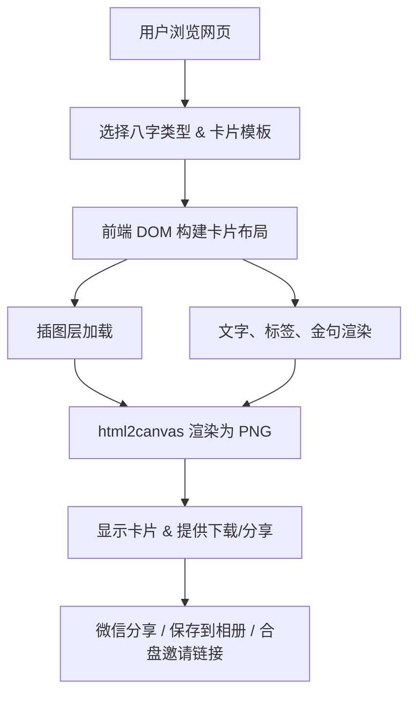

# 前端卡片生成架构图


```

**说明**：
- 插图层：使用 AI 生成通用插图，动态叠加用户标签/文字。
- DOM 构建：HTML/CSS 实现卡片布局，灵活控制文字和位置。
- 渲染 PNG：html2canvas / dom-to-image 生成高分辨率图片。
- 分享路径：可直接调用微信 JS-SDK 或生成下载链接。
- 优点：零服务端压力，灵活可组合，支持动态数据渲染。